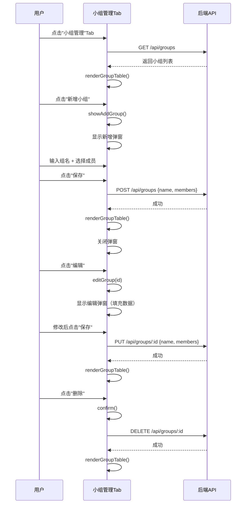
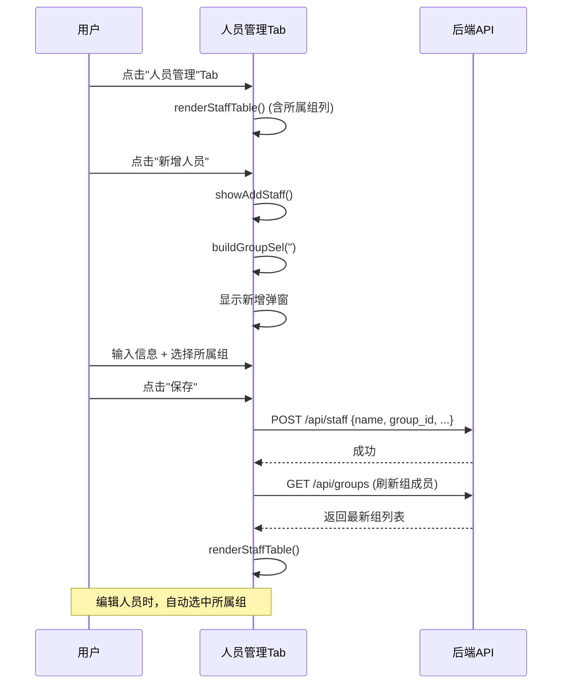
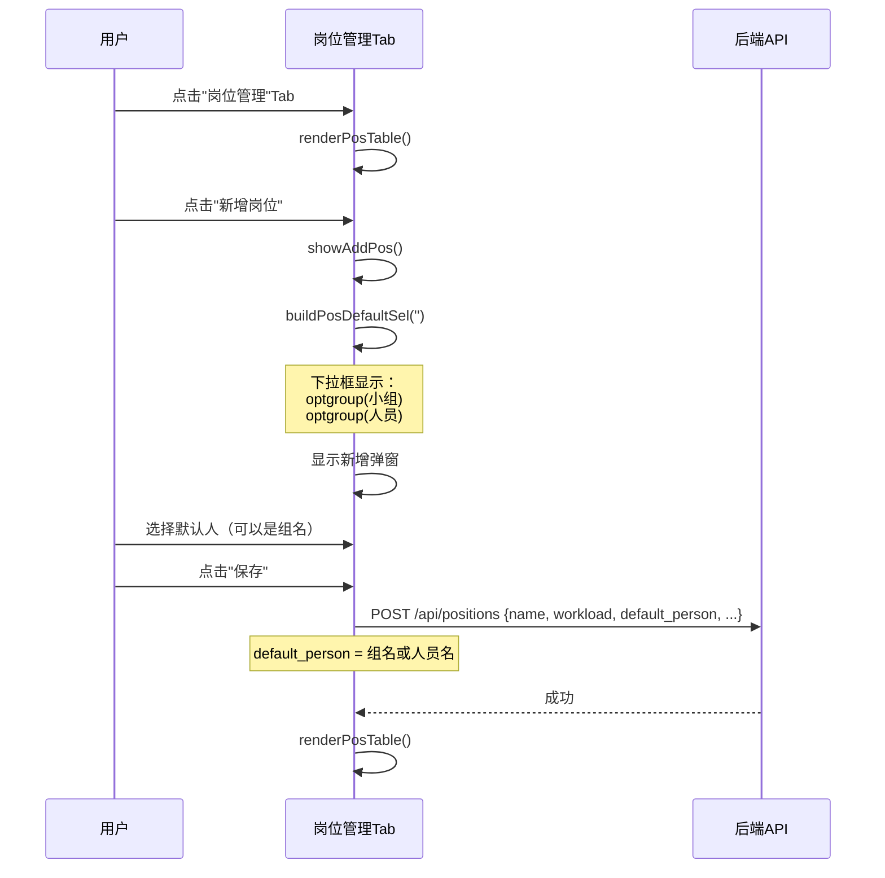

# 智能排班系统 - 前端界面设计文档

> 任务 #3: 前端小组管理功能详细设计
> 
> 架构师：Bob (software-architect)
> 
> 日期：2025-01-XX

---

## 一、概述

本文档详细描述智能排班系统小组管理功能的前端实现方案，包括：
1. 小组管理 Tab UI 设计
2. 人员管理页面修改（新增"所属组"列）
3. 岗位管理页面修改（default_person 下拉框支持组名）
4. 工作量统计修改（支持组均摊）
5. 前端状态管理和数据加载

---

## 二、现有代码结构分析

### 2.1 技术栈
- 纯 HTML + CSS + JavaScript（无框架）
- 后端 API 通过 `fetch` 调用
- 全局状态对象 `G` 存储所有数据

### 2.2 关键全局变量

```javascript
let G = {
  year: 2025,
  month: 1,
  positions: [],      // 岗位列表
  staff: [],          // 人员列表
  schedule: {},       // 排班数据
  editingStaffId: null,
  editingPosId: null,
  polling: null,
  userBusy: false,
  lastPollHash: '',
};
```

### 2.3 现有管理弹窗结构

**人员/岗位管理弹窗** (`#mgr-modal`):
- 两个 Tab：人员管理、岗位管理
- 人员管理表格：姓名、次品替班、京东替班、仅周六替班、不替班、操作
- 岗位管理表格：岗位名称、工作量、默认人员、岗位类别、操作

---

## 三、详细设计

### 3.1 新增"小组管理"Tab

#### 3.1.1 Tab 布局修改

**现有 HTML** (index.html:346-349):
```html
<div class="mgr-tabs">
  <div class="mgr-tab active" onclick="switchMgrTab('staff',this)">人员管理</div>
  <div class="mgr-tab" onclick="switchMgrTab('pos',this)">岗位管理</div>
</div>
```

**修改后**:
```html
<div class="mgr-tabs">
  <div class="mgr-tab" onclick="switchMgrTab('staff',this)">人员管理</div>
  <div class="mgr-tab" onclick="switchMgrTab('pos',this)">岗位管理</div>
  <div class="mgr-tab" onclick="switchMgrTab('group',this)">小组管理</div>
</div>
```

**CSS 样式**: 保持现有 `.mgr-tab` 样式不变。

#### 3.1.2 小组管理页面 HTML

**插入位置**: 在 `#mgr-pos` div 之后（index.html:373 之后）

```html
<!-- 小组管理 -->
<div id="mgr-group" style="display:none">
  <div style="margin-bottom:10px">
    <button class="btn btn-blue" onclick="showAddGroup()">＋ 新增小组</button>
  </div>
  <table class="data-table" id="group-table">
    <thead><tr>
      <th>小组名称</th>
      <th>成员</th>
      <th>操作</th>
    </tr></thead>
    <tbody id="group-tbody"></tbody>
  </table>
</div>
```

#### 3.1.3 小组列表渲染

**函数**: `renderGroupTable()`

```javascript
function renderGroupTable(){
  $('group-tbody').innerHTML = G.groups.map(g => {
    // 获取成员名字列表
    const memberNames = (g.members || [])
      .map(sid => {
        const s = G.staff.find(x => x.id === sid);
        return s ? s.name : '(已删除)';
      })
      .join(', ');
    
    return `<tr>
      <td><b>${g.name}</b></td>
      <td style="font-size:11px;color:#555">${memberNames || '<span style="color:#999">暂无成员</span>'}</td>
      <td>
        <button class="action-btn edit" onclick="editGroup('${g.id}')">编辑</button>
        <button class="action-btn del" onclick="delGroup('${g.id}','${g.name}')">删除</button>
      </td>
    </tr>`;
  }).join('');
}
```

#### 3.1.4 新增/编辑小组弹窗

**HTML** (插入到 `#pos-modal` 之后):

```html
<!-- 新增/编辑小组弹窗 -->
<div id="group-modal" class="modal-overlay" style="display:none">
  <div class="modal">
    <span class="modal-close" onclick="closeGroupModal()">✕</span>
    <h2 id="group-modal-title">新增小组</h2>
    <div class="form-row"><label>小组名称</label><input type="text" id="group-name" placeholder="如：鞋包组"></div>
    <div class="form-row" style="align-items:flex-start">
      <label>成员</label>
      <div id="group-members" style="flex:1;max-height:200px;overflow-y:auto;border:1px solid #ccc;border-radius:4px;padding:8px">
        <!-- 动态生成复选框 -->
      </div>
    </div>
    <div class="form-actions">
      <button class="btn btn-gray" onclick="closeGroupModal()">取消</button>
      <button class="btn btn-blue" onclick="saveGroup()">保存</button>
    </div>
  </div>
</div>
```

**样式说明**:
- 成员选择区域使用多选复选框
- 显示所有人员，已选中的打勾
- 支持滚动（max-height + overflow-y:auto）

#### 3.1.5 成员多选组件

**函数**: `renderGroupMembers(selectedMembers)`

```javascript
function renderGroupMembers(selectedMembers=[]){
  const container = $('group-members');
  container.innerHTML = G.staff.map(m => {
    const checked = selectedMembers.includes(m.id) ? 'checked' : '';
    return `<label style="display:flex;align-items:center;gap:6px;padding:4px 0;cursor:pointer">
      <input type="checkbox" value="${m.id}" ${checked}>
      <span style="font-size:12px">${m.name}</span>
    </label>`;
  }).join('');
}
```

#### 3.1.6 小组 CRUD 操作

**新增小组**:
```javascript
function showAddGroup(){
  G.editingGroupId = null;
  $('group-modal-title').textContent = '新增小组';
  $('group-name').value = '';
  renderGroupMembers([]);  // 初始无成员
  $('group-modal').style.display = 'flex';
}
```

**编辑小组**:
```javascript
function editGroup(id){
  const g = G.groups.find(x => x.id === id);
  if(!g) return;
  G.editingGroupId = id;
  $('group-modal-title').textContent = '编辑小组';
  $('group-name').value = g.name;
  renderGroupMembers(g.members || []);
  $('group-modal').style.display = 'flex';
}
```

**保存小组**:
```javascript
async function saveGroup(){
  const name = $('group-name').value.trim();
  if(!name){ toast('请输入小组名称'); return; }
  
  // 获取选中的成员
  const members = [];
  $('group-members').querySelectorAll('input[type=checkbox]:checked').forEach(cb => {
    members.push(cb.value);
  });
  
  const body = { name, members };
  loading(true);
  try{
    if(G.editingGroupId){
      await api('/api/groups/' + G.editingGroupId, 'PUT', body);
      toast('小组已更新');
    } else {
      await api('/api/groups', 'POST', body);
      toast('小组已新增');
    }
    G.groups = await api('/api/groups');
    renderGroupTable();
    closeGroupModal();
  }catch(e){ toast('保存失败: '+e.message, 3000); }
  finally{ loading(false); }
}
```

**删除小组**:
```javascript
async function delGroup(id, name){
  if(!confirm(`确定删除小组「${name}」吗？`)) return;
  loading(true);
  try{
    await api('/api/groups/'+id, 'DELETE');
    G.groups = await api('/api/groups');
    renderGroupTable();
    toast('已删除');
  }catch(e){ toast('删除失败', 3000); }
  finally{ loading(false); }
}
```

**⚠️ 重要：组名修改时同步更新 positions.json**

当编辑小组并**修改组名**时，后端需要同步更新 `positions.json` 中所有 `default_person` = 旧组名的记录。

**后端处理逻辑** (在 `PUT /api/groups/:id` 中实现):

```python
# app.py - update_group() 函数

@app.route('/api/groups/<group_id>', methods=['PUT'])
def update_group(group_id):
    body = request.get_json()
    groups = load_groups()
    
    group = next((g for g in groups if g['id'] == group_id), None)
    if not group:
        return {'error': 'Group not found'}, 404
    
    # 检查组名是否被修改
    old_name = group['name']
    new_name = body.get('name', old_name)
    
    # 更新组信息
    group['name'] = new_name
    group['members'] = body.get('members', group['members'])
    
    # 如果组名被修改，同步更新 positions.json
    if old_name != new_name:
        positions = load_positions()
        for pos in positions:
            if pos.get('default_person') == old_name:
                pos['default_person'] = new_name
        save_positions(positions)
    
    save_groups(groups)
    return {'ok': True}
```

**前端行为**:
- 前端无需特殊处理
- 调用 `PUT /api/groups/:id` 时，传递新的 `name`
- 后端自动处理 `positions.json` 的同步更新
- 前端重新加载 `G.positions` 以反映更新

**删除小组时的处理**:

如果删除小组，岗位管理中的 `default_person` 如果等于被删除的组名，应该设置为空：

```python
# app.py - delete_group() 函数

@app.route('/api/groups/<group_id>', methods=['DELETE'])
def delete_group(group_id):
    groups = load_groups()
    group = next((g for g in groups if g['id'] == group_id), None)
    if not group:
        return {'error': 'Group not found'}, 404
    
    # 删除组
    groups = [g for g in groups if g['id'] != group_id]
    
    # 同步更新 positions.json：将该组从 default_person 中移除
    positions = load_positions()
    for pos in positions:
        if pos.get('default_person') == group['name']:
            pos['default_person'] = ''
    save_positions(positions)
    
    save_groups(groups)
    return {'ok': True}
```

**前端配合**:
- 删除小组后，重新加载 `G.positions`
- 岗位管理表格中，该岗位的"默认人员"列显示为"--"

---

**关闭弹窗**:
```javascript
function closeGroupModal(){
  $('group-modal').style.display = 'none';
}
```

---

### 3.2 人员管理页面修改

#### 3.2.1 表格新增"所属组"列

**现有 HTML** (index.html:356-359):
```html
<thead><tr>
  <th>姓名</th><th>次品替班</th><th>京东替班</th><th>仅周六替班</th><th>不替班</th><th>操作</th>
</tr></thead>
```

**修改后**:
```html
<thead><tr>
  <th>姓名</th><th>所属组</th><th>次品替班</th><th>京东替班</th><th>仅周六替班</th><th>不替班</th><th>操作</th>
</tr></thead>
```

#### 3.2.2 渲染逻辑修改

**函数**: `renderStaffTable()`

**修改前** (index.html:1552-1564):
```javascript
function renderStaffTable(){
  $('staff-tbody').innerHTML = G.staff.map(m => `
    <tr>
      <td>${m.name}</td>
      <td style="text-align:center">${m.can_cpin?'<span class="tag tag-cpin">✓ 次品</span>':'—'}</td>
      ...
```

**修改后**:
```javascript
function renderStaffTable(){
  $('staff-tbody').innerHTML = G.staff.map(m => {
    // 查找所属组
    const group = G.groups.find(g => (g.members || []).includes(m.id));
    const groupName = group ? group.name : '—';
    
    return `<tr>
      <td>${m.name}</td>
      <td style="text-align:center;font-size:11px;color:#1976d2">${groupName}</td>
      <td style="text-align:center">${m.can_cpin?'<span class="tag tag-cpin">✓ 次品</span>':'—'}</td>
      <td style="text-align:center">${m.can_jd?'<span class="tag tag-jd">✓ 京东</span>':'—'}</td>
      <td style="text-align:center">${m.saturday_only?'<span class="tag tag-sat">仅周六</span>':'—'}</td>
      <td style="text-align:center">${m.no_substitute?'<span class="tag" style="background:#ef9a9a;color:#b71c1c;border:1px solid #e57373">不替班</span>':'—'}</td>
      <td>
        <button class="action-btn edit" onclick="editStaff('${m.id}')">编辑</button>
        <button class="action-btn del" onclick="delStaff('${m.id}','${m.name}')">删除</button>
      </td>
    </tr>`;
  }).join('');
}
```

#### 3.2.3 新增/编辑人员弹窗修改

**现有 HTML** (index.html:382-407):
- 需要在"不替班"复选框之前添加"所属组"下拉框

**修改后**:
```html
<div class="form-row">
  <label>所属组</label>
  <select id="staff-group" style="flex:1;padding:5px 8px;border:1px solid #ccc;border-radius:4px;font-size:12px">
    <option value="">-- 无 --</option>
  </select>
</div>
<div class="form-row">
  <label>不替班</label>
  <input type="checkbox" id="staff-no-sub" title="勾选后不替别人的班，只能别人替他的班">
  <span style="font-size:11px;color:#e53935">勾选后不会被选为替班人，但别人可以替他的班</span>
</div>
```

#### 3.2.4 组下拉框渲染

**函数**: `buildGroupSel(selectedGroupId)`

```javascript
function buildGroupSel(selectedGroupId=''){
  const sel = $('staff-group');
  sel.innerHTML = '<option value="">-- 无 --</option>';
  for(const g of G.groups){
    const o = document.createElement('option');
    o.value = g.id;
    o.textContent = g.name;
    if(g.id === selectedGroupId) o.selected = true;
    sel.appendChild(o);
  }
}
```

#### 3.2.5 新增/编辑人员逻辑修改

**showAddStaff() 修改**:
```javascript
function showAddStaff(){
  G.editingStaffId = null;
  $('staff-modal-title').textContent = '新增人员';
  $('staff-name').value = '';
  $('staff-cpin').checked = false;
  $('staff-jd').checked = false;
  $('staff-sat').checked = false;
  $('staff-no-sub').checked = false;
  buildGroupSel('');  // 新增时默认"无"组
  $('staff-modal').style.display = 'flex';
}
```

**editStaff(id) 修改**:
```javascript
function editStaff(id){
  const m = G.staff.find(s => s.id === id);
  if(!m) return;
  G.editingStaffId = id;
  $('staff-modal-title').textContent = '编辑人员';
  $('staff-name').value = m.name;
  $('staff-cpin').checked = m.can_cpin || false;
  $('staff-jd').checked = m.can_jd || false;
  $('staff-sat').checked = m.saturday_only || false;
  $('staff-no-sub').checked = m.no_substitute || false;
  
  // 查找该人员所属组
  const group = G.groups.find(g => (g.members || []).includes(id));
  buildGroupSel(group ? group.id : '');
  
  $('staff-modal').style.display = 'flex';
}
```

**saveStaff() 修改**:
```javascript
async function saveStaff(){
  const name = $('staff-name').value.trim();
  if(!name){ toast('请输入姓名'); return; }
  
  const groupId = $('staff-group').value;  // 空字符串表示"无"
  
  const body = {
    name,
    can_cpin: $('staff-cpin').checked,
    can_jd: $('staff-jd').checked,
    saturday_only: $('staff-sat').checked,
    no_substitute: $('staff-no-sub').checked,
    group_id: groupId  // 新增字段
  };
  
  loading(true);
  try{
    if(G.editingStaffId){
      await api('/api/staff/' + G.editingStaffId, 'PUT', body);
      toast('人员已更新');
    } else {
      await api('/api/staff', 'POST', body);
      toast('人员已新增');
    }
    G.staff = await api('/api/staff');
    G.groups = await api('/api/groups');  // 重新加载组（成员可能变化）
    renderStaffTable();
    closeStaffModal();
    renderTable();
  }catch(e){ toast('保存失败: '+e.message, 3000); }
  finally{ loading(false); }
}
```

---

### 3.3 岗位管理页面修改

#### 3.3.1 default_person 下拉框支持组名

**现有函数** `buildPosDefaultSel(selected)` (index.html:1655-1664):

```javascript
function buildPosDefaultSel(selected){
  const sel = $('pos-default');
  sel.innerHTML = '<option value="">-- 无默认人 --</option>';
  for(const m of G.staff){
    const o = document.createElement('option');
    o.value = m.name; o.textContent = m.name;
    if(m.name === selected) o.selected = true;
    sel.appendChild(o);
  }
}
```

**修改后**:
```javascript
function buildPosDefaultSel(selected){
  const sel = $('pos-default');
  sel.innerHTML = '<option value="">-- 无默认人 --</option>';
  
  // 第一组：小组
  if(G.groups && G.groups.length > 0){
    const groupOpt = document.createElement('optgroup');
    groupOpt.label = '小组';
    for(const g of G.groups){
      const o = document.createElement('option');
      o.value = g.name;  // 使用组名作为值
      o.textContent = g.name;
      if(g.name === selected) o.selected = true;
      groupOpt.appendChild(o);
    }
    sel.appendChild(groupOpt);
  }
  
  // 第二组：人员
  const personOpt = document.createElement('optgroup');
  personOpt.label = '人员';
  for(const m of G.staff){
    const o = document.createElement('option');
    o.value = m.name;
    o.textContent = m.name;
    if(m.name === selected) o.selected = true;
    personOpt.appendChild(o);
  }
  sel.appendChild(personOpt);
}
```

**说明**:
- 使用 `<optgroup>` 将小组和人员分组显示
- `value` 仍然是名称（组名或人员名），后端通过 `is_group()` 判断是组还是人员
- 前端无需修改保存逻辑（`pos.default_person` 存储名称）

---

### 3.4 工作量统计修改

#### 3.4.1 修改 `calcDayWorkload(day)` 支持组均摊

**现有函数** (index.html:1405-1418):

```javascript
function calcDayWorkload(day){
  const result = {};
  const dayData = G.schedule[day] || {};
  for(const pos of G.positions){
    const cell = dayData[pos.id];
    const status = cell ? cell.status : (pos.default_person ? 'on' : 'pending');
    const person = cell ? cell.person : pos.default_person || '';
    if((status === 'on' || status === 'substitute') && person){
      result[person] = (result[person] || 0) + pos.workload;
    }
  }
  return result;
}
```

**修改后**:
```javascript
function calcDayWorkload(day){
  const result = {};
  const dayData = G.schedule[day] || {};
  
  for(const pos of G.positions){
    const cell = dayData[pos.id];
    const status = cell ? cell.status : (pos.default_person ? 'on' : 'pending');
    const person = cell ? cell.person : pos.default_person || '';
    
    if((status === 'on' || status === 'substitute') && person){
      // 检查 person 是否是组名
      const group = G.groups ? G.groups.find(g => g.name === person) : null;
      
      if(group){
        // 组岗位：均摊给当日未休的组员
        const activeMembers = getGroupActiveMembers(group, dayData);
        if(activeMembers.length > 0){
          const share = pos.workload / activeMembers.length;
          for(const mName of activeMembers){
            result[mName] = (result[mName] || 0) + share;
          }
        }
      } else {
        // 人员岗位：直接加给该人员
        result[person] = (result[person] || 0) + pos.workload;
      }
    }
  }
  return result;
}
```

#### 3.4.2 新增辅助函数 `getGroupActiveMembers(group, dayData)`

```javascript
function getGroupActiveMembers(group, dayData){
  const activeMembers = [];
  const members = group.members || [];
  
  for(const sid of members){
    const m = G.staff.find(s => s.id === sid);
    if(!m) continue;
    
    // 检查此人当日是否休息
    let isOff = false;
    for(const [pid, cell] of Object.entries(dayData)){
      if(cell.person === m.name && cell.status === 'off'){
        isOff = true;
        break;
      }
    }
    
    if(!isOff){
      activeMembers.push(m.name);
    }
  }
  
  return activeMembers;
}
```

**说明**:
- 遍历组的成员列表
- 检查每个成员当日是否有 `status === 'off'` 的记录
- 返回未休息的成员名字列表
- 工作量均摊：`pos.workload / activeMembers.length`

---

### 3.5 前端状态管理

#### 3.5.1 全局状态 `G` 新增 `groups`

**修改位置**: index.html:451-463

```javascript
let G = {
  year: new Date().getFullYear(),
  month: new Date().getMonth() + 1,
  positions: [],
  staff: [],
  groups: [],          // 新增：小组列表
  schedule: {},
  editingStaffId: null,
  editingPosId: null,
  editingGroupId: null,  // 新增：正在编辑的小组ID
  // ... 其他字段
};
```

#### 3.5.2 修改 `loadAll()` 加载 groups

**现有函数** (index.html:605-640):

```javascript
async function loadAll(){
  loading(true);
  try{
    [G.positions, G.staff] = await Promise.all([
      api('/api/positions'),
      api('/api/staff'),
    ]);
    G.schedule = await api(`/api/schedule/${G.year}/${G.month}`);
    // ...
  }catch(e){ /* ... */ }
  finally{ loading(false); }
}
```

**修改后**:
```javascript
async function loadAll(){
  loading(true);
  try{
    [G.positions, G.staff, G.groups] = await Promise.all([
      api('/api/positions'),
      api('/api/staff'),
      api('/api/groups'),  // 新增：加载小组
    ]);
    G.schedule = await api(`/api/schedule/${G.year}/${G.month}`);
    
    loadHiddenDays();
    G.lastPollHash = JSON.stringify({
      positions: G.positions,
      staff: G.staff,
      groups: G.groups,  // 新增
      schedule: G.schedule
    });
    
    buildDaySel();
    renderTable();
    renderDayStat();
    renderWeekStat();
    renderMonthStat();
  }catch(e){
    toast('加载失败: ' + e.message, 3000);
  }finally{
    loading(false);
  }
}
```

#### 3.5.3 修改 `switchMgrTab(tab, el)` 支持小组管理

**现有函数** (index.html:1354-1539):

```javascript
function switchMgrTab(tab, el){
  document.querySelectorAll('.mgr-tab').forEach(t => t.classList.remove('active'));
  el.classList.add('active');
  $('mgr-staff').style.display = tab === 'staff' ? 'block' : 'none';
  $('mgr-pos').style.display   = tab === 'pos'  ? 'block' : 'none';
}
```

**修改后**:
```javascript
function switchMgrTab(tab, el){
  document.querySelectorAll('.mgr-tab').forEach(t => t.classList.remove('active'));
  el.classList.add('active');
  $('mgr-staff').style.display = tab === 'staff' ? 'block' : 'none';
  $('mgr-pos').style.display   = tab === 'pos'  ? 'block' : 'none';
  $('mgr-group').style.display = tab === 'group' ? 'block' : 'none';
  
  // 切换到小组管理时，渲染小组表格
  if(tab === 'group'){
    renderGroupTable();
  }
}
```

---

## 四、交互流程图

### 4.1 小组管理流程



### 4.2 人员管理流程（含所属组）



### 4.3 岗位管理流程（含组名）



---

## 五、数据迁移前端配合

### 5.1 迁移后前端行为

1. **首次加载**:
   - `loadAll()` 会加载 `groups` 数据
   - 如果 `groups.json` 已迁移，`G.groups` 非空

2. **人员管理**:
   - 现有人员（如"赵创"）会显示所属组（如"款色组"）
   - 如果 `group_id` 为空，显示"--"

3. **岗位管理**:
   - 现有岗位的 `default_person` 如果是组名（如"鞋包组"），下拉框会选中该组

### 5.2 前端无需特殊处理

- 数据迁移是后端任务（修改 `staff.json` 和创建 `groups.json`）
- 前端只需正确加载和显示数据

---

## 六、测试要点

### 6.1 单元测试（前端逻辑）

| 测试项 | 输入 | 预期输出 |
|--------|------|----------|
| `getGroupActiveMembers()` | 组 + 某日排班数据 | 返回未休成员列表 |
| `calcDayWorkload()` | 某日 | 组岗位工作量正确均摊 |
| `buildPosDefaultSel()` | 无 | 下拉框包含组和人员（分组显示） |
| `renderGroupTable()` | G.groups | 表格正确显示组和成员 |
| `renderStaffTable()` | G.staff + G.groups | 表格正确显示所属组 |

### 6.2 集成测试

1. **小组管理**:
   - 新增小组 → 列表更新
   - 编辑小组 → 名称和成员更新
   - 删除小组 → 列表更新
   - 删除小组后，相关人员的"所属组"显示为"--"

2. **人员管理**:
   - 新增人员时选择组 → 该人员出现在组的成员列表中
   - 编辑人员时修改组 → 组成员列表更新
   - 删除人员 → 从组的成员列表中移除

3. **岗位管理**:
   - 新增岗位时选择组名作为默认人 → 保存成功
   - 编辑岗位时切换默认人（组 ↔ 人员）→ 保存成功
   - 排班表显示组名（如果 `default_person` 是组名）

4. **工作量统计**:
   - 组岗位的工作量正确均摊给当日未休组员
   - 组全休时，该岗位显示"待定"或替班人

---

## 七、文件变更清单

### 7.1 `static/index.html` 变更

| 位置 | 变更类型 | 说明 |
|------|----------|------|
| `<style>` | 新增 | 无需新增样式（复用现有） |
| `#mgr-tabs` | 修改 | 新增"小组管理"Tab |
| `#mgr-group` | 新增 | 小组管理页面 HTML |
| `#staff-table thead` | 修改 | 新增"所属组"列 |
| `#staff-modal .form-row` | 新增 | 新增"所属组"下拉框 |
| `#group-modal` | 新增 | 新增/编辑小组弹窗 |
| `<script>` - `G` 对象 | 修改 | 新增 `groups: []` 和 `editingGroupId` |
| `<script>` - `loadAll()` | 修改 | 加载 groups |
| `<script>` - `switchMgrTab()` | 修改 | 支持 group tab |
| `<script>` - `renderStaffTable()` | 修改 | 显示所属组 |
| `<script>` - `renderGroupTable()` | 新增 | 渲染小组列表 |
| `<script>` - `showAddGroup()` | 新增 | 显示新增小组弹窗 |
| `<script>` - `editGroup()` | 新增 | 显示编辑小组弹窗 |
| `<script>` - `saveGroup()` | 新增 | 保存小组 |
| `<script>` - `delGroup()` | 新增 | 删除小组 |
| `<script>` - `closeGroupModal()` | 新增 | 关闭小组弹窗 |
| `<script>` - `renderGroupMembers()` | 新增 | 渲染成员多选 |
| `<script>` - `buildGroupSel()` | 新增 | 渲染组下拉框 |
| `<script>` - `showAddStaff()` | 修改 | 调用 buildGroupSel() |
| `<script>` - `editStaff()` | 修改 | 调用 buildGroupSel() |
| `<script>` - `saveStaff()` | 修改 | 保存 group_id |
| `<script>` - `buildPosDefaultSel()` | 修改 | 支持组名（optgroup） |
| `<script>` - `calcDayWorkload()` | 修改 | 支持组均摊 |
| `<script>` - `getGroupActiveMembers()` | 新增 | 获取组当日未休成员 |

### 7.2 无新增文件

所有修改都在 `static/index.html` 中完成（符合现有架构）。

---

## 八、实施顺序

基于系统设计的任务分解（T01-T05），前端的实施顺序为：

1. **T02 完成后** (后端 Group API 可用):
   - 新增"小组管理"Tab HTML
   - 实现 `renderGroupTable()`
   - 实现小组 CRUD (`showAddGroup`, `editGroup`, `saveGroup`, `delGroup`)
   - 测试小组管理功能

2. **与 T03 并行**:
   - 修改人员管理（新增"所属组"列和下拉框）
   - 修改岗位管理（default_person 下拉框支持组名）
   - 测试人员和岗位管理

3. **T04 主体完成后**:
   - 修改 `calcDayWorkload()` 支持组均摊
   - 新增 `getGroupActiveMembers()`
   - 测试工作量统计

4. **T05 数据迁移后**:
   - 集成测试：验证迁移后前端显示正确
   - 端到端测试：完整流程

---

## 九、风险与缓解

| 风险 | 影响 | 缓解措施 |
|------|------|----------|
| 组名下拉框显示过长 | UI 不美观 | 使用 `<optgroup>` 分组，控制每组成员显示 |
| 成员多选组件性能 | 人员多时卡顿 | 当前数据规模小（<50人），无需优化；后续可虚拟滚动 |
| 组均摊逻辑复杂 | 工作量统计错误 | 详细单元测试 + 人工验证 |
| 数据迁移后前端异常 | 系统不可用 | 保留原有逻辑作为 fallback，逐步切换 |

---

## 十、总结

本文档详细设计了智能排班系统小组管理功能的前端实现方案，包括：

1. **小组管理 Tab**: 完整的 CRUD 界面和交互流程
2. **人员管理修改**: 新增"所属组"列和下拉框
3. **岗位管理修改**: default_person 下拉框支持组名（optgroup 分组）
4. **工作量统计修改**: 支持组均摊逻辑
5. **前端状态管理**: 新增 `G.groups` 并修改 `loadAll()`

所有修改都基于现有代码风格和架构，确保一致性和可维护性。

---

## 附录：完整代码示例

### A. 小组管理 HTML 完整代码

```html
<!-- 小组管理 -->
<div id="mgr-group" style="display:none">
  <div style="margin-bottom:10px">
    <button class="btn btn-blue" onclick="showAddGroup()">＋ 新增小组</button>
  </div>
  <table class="data-table" id="group-table">
    <thead><tr>
      <th>小组名称</th>
      <th>成员</th>
      <th>操作</th>
    </tr></thead>
    <tbody id="group-tbody"></tbody>
  </table>
</div>

<!-- 新增/编辑小组弹窗 -->
<div id="group-modal" class="modal-overlay" style="display:none">
  <div class="modal">
    <span class="modal-close" onclick="closeGroupModal()">✕</span>
    <h2 id="group-modal-title">新增小组</h2>
    <div class="form-row"><label>小组名称</label><input type="text" id="group-name" placeholder="如：鞋包组"></div>
    <div class="form-row" style="align-items:flex-start">
      <label>成员</label>
      <div id="group-members" style="flex:1;max-height:200px;overflow-y:auto;border:1px solid #ccc;border-radius:4px;padding:8px">
        <!-- 动态生成复选框 -->
      </div>
    </div>
    <div class="form-actions">
      <button class="btn btn-gray" onclick="closeGroupModal()">取消</button>
      <button class="btn btn-blue" onclick="saveGroup()">保存</button>
    </div>
  </div>
</div>
```

### B. 关键 JavaScript 函数完整代码

参见第三节中的代码示例。

---

**文档结束**

---

**审批记录**:

| 角色 | 姓名 | 审批意见 | 日期 |
|------|------|----------|------|
| 架构师 | Bob | 已批准 | 2025-01-XX |
| 团队负责人 | team-lead | 待审批 | - |
| 工程师 | software-engineer | 待审批 | - |
