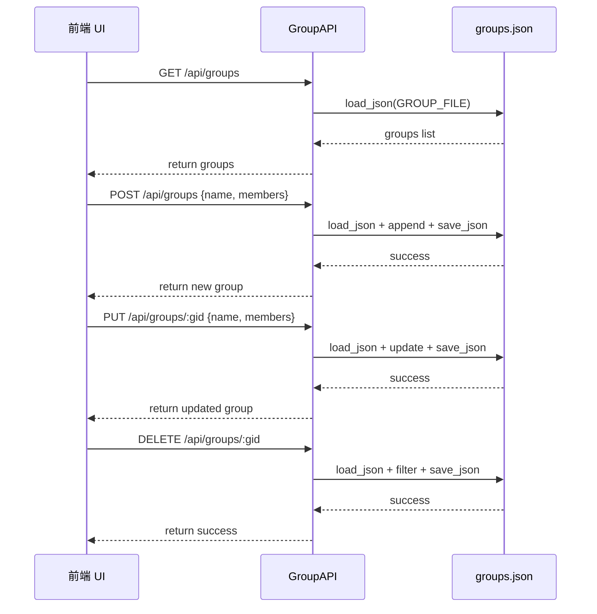
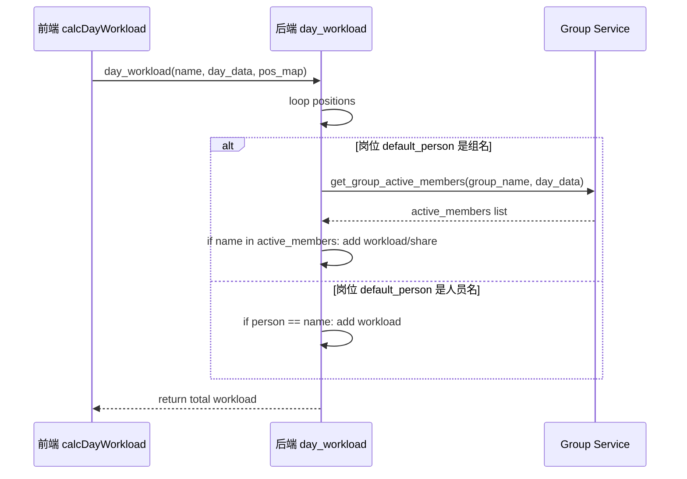
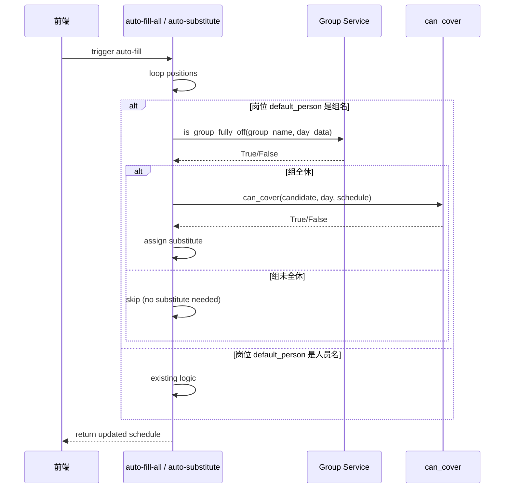
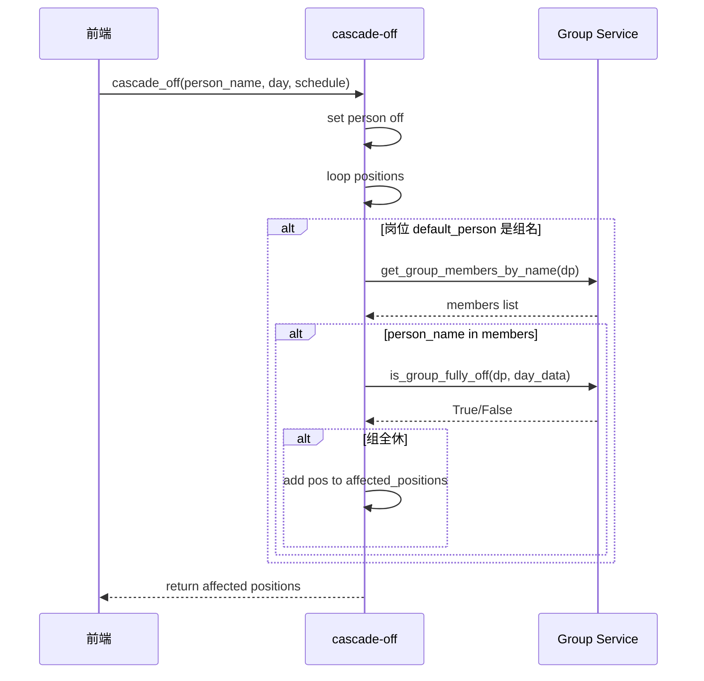
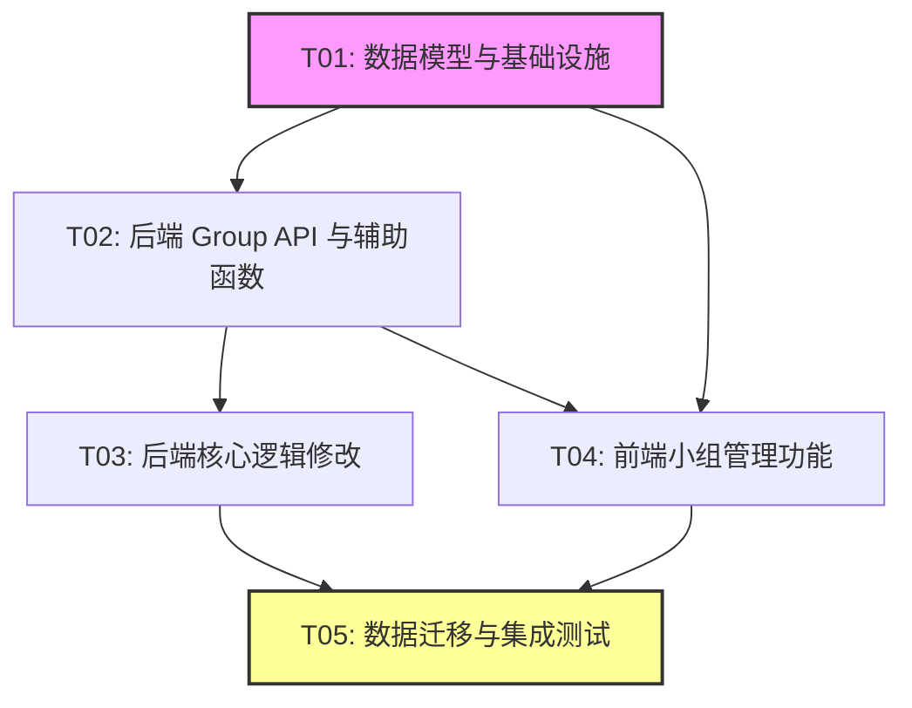

# 智能排班系统 - 小组管理功能系统设计与任务分解

> 基于已批准的plan（quantum-thunder-curie.md）输出增量任务列表
> 
> 架构师：Bob (software-architect)
> 
> 日期：2025-01-XX

---

## Part A: System Design

### 1. Implementation Approach

#### Core Technical Challenges

1. **数据模型重构**：需要将原本混在人员列表中的"小组"概念分离出来，建立独立的数据模型
2. **组均摊工作量计算**：需要修改三处 `day_workload` 函数，支持将组岗位的工作量均摊给当日未休的组员
3. **组全休判断逻辑**：需要实现 `is_group_fully_off` 来判断是否需要为组岗位找替班
4. **级联休息扩展**：需要修改 `cascade-off` 逻辑，支持组岗位级联
5. **前后端数据同步**：需要确保前端正确加载和显示组信息

#### Framework and Library Selections

- **后端**：继续使用 Python Flask（无需引入新框架）
- **前端**：继续使用纯 HTML/CSS/JS（无需引入新框架）
- **数据存储**：继续使用 JSON 文件（无需引入数据库）

#### Architecture Patterns

- **MVC Pattern**：保持现有架构，后端 Controller (app.py) + 前端 View (index.html) + 数据 Model (JSON files)
- **API-First**：先完成后端 API，再进行前端集成

---

### 2. File List

| 文件路径 | 类型 | 说明 |
|---------|------|------|
| `data/groups.json` | 新增 | 存储小组数据 |
| `data/staff.json` | 修改 | 新增 `group_id` 字段，删除组记录 |
| `data/positions.json` | 不变 | 保持现有格式 |
| `data/schedule.json` | 不变 | 保持现有格式 |
| `app.py` | 修改 | 后端主文件，新增API和逻辑修改 |
| `static/index.html` | 修改 | 前端单文件，新增小组管理UI |
| `migrate_groups.py` | 新增 | 数据迁移脚本（可选） |

---

### 3. Data Structures and Interfaces

```mermaid
classDiagram
    class Group {
        +string id
        +string name
        +list members: [staff_id, ...]
    }
    
    class Staff {
        +string id
        +string name
        +string group_id
        +bool no_substitute
        +string color
    }
    
    class Position {
        +string id
        +string name
        +string default_person
        +float workload
        +int count
    }
    
    class Schedule {
        +dict schedule: {day: {pos_id: cell}}
    }
    
    class Cell {
        +string status: "on"|"off"|"substitute"|"pending"
        +string person
    }
    
    class GroupAPI {
        +get_groups() list
        +create_group(data) dict
        +update_group(gid, data) dict
        +delete_group(gid) dict
    }
    
    class StaffAPI {
        +get_staff() list
        +create_staff(data) dict
        +update_staff(sid, data) dict
        +delete_staff(sid) dict
    }
    
    class WorkloadService {
        +day_workload(name, day_data, pos_map) float
        +calcDayWorkload(day) dict
    }
    
    class SubstituteService {
        +can_cover(name, day, schedule) bool
        +is_group_fully_off(group_name, day_data) bool
        +get_group_active_members(group_name, day_data) list
    }
    
    Group "1" -- "*" Staff : members
    Staff "*" -- "0..1" Group : group_id
    Position --> Group : default_person can be group name
    Position --> Staff : default_person can be staff name
    Schedule --> Cell : day_data
    GroupAPI --> Group : CRUD
    StaffAPI --> Staff : CRUD
    WorkloadService --> Group : uses
    SubstituteService --> Group : uses
```

---

### 4. Program Call Flow

#### 4.1 小组管理流程（Group CRUD）



#### 4.2 组岗位工作量均摊流程



#### 4.3 组全休判断与替班触发流程



#### 4.4 级联休息组岗位处理流程



---

### 5. Anything UNCLEAR

1. **数据迁移时机**：是在应用启动时自动执行，还是提供手动脚本？
   - **假设**：在 `init_data()` 函数中自动执行一次迁移

2. **组名冲突处理**：如果用户在小组管理中创建同名组，如何处理？
   - **假设**：后端校验组名唯一性，返回错误提示

3. **删除组的影响**：删除组后，原本设置该组为默认人的岗位如何处理？
   - **假设**：删除组时，前端提示用户先修改相关岗位的默认人设置

4. **组会员空时的行为**：如果组没有成员，该组岗位如何处理？
   - **假设**：组没有成员时，视为全休，需要替班

5. **前端性能**：如果组和人员数量很大，前端下拉框性能是否受影响？
   - **假设**：当前数据规模较小，不使用虚拟滚动

---

## Part B: Task Decomposition

### 6. Required Packages

无需新增第三方包，继续使用现有依赖：
```
- Flask==2.3.3 (现有)
- 无新增前端依赖（纯HTML/CSS/JS）
```

---

### 7. Task List (ordered by dependency)

#### **T01: 数据模型与基础设施** ⚙️ `P0` `并行:T02可并行`

| 属性 | 值 |
|------|-----|
| **Task ID** | T01 |
| **Task Name** | 数据模型与基础设施搭建 |
| **Source Files** | `data/groups.json` (新), `data/staff.json` (改), `app.py` (改) |
| **Dependencies** | 无 |
| **Priority** | P0 |

**任务描述**：
1. 创建 `data/groups.json` 文件，定义数据结构
2. 修改 `app.py`，新增 `GROUP_FILE` 常量和处理函数
3. 修改 `data/staff.json`，为现有人员新增 `group_id` 字段（初始为空）
4. 实现数据迁移逻辑（从 staff.json 中提取组记录，创建 groups.json）

**验收标准**：
- `groups.json` 文件存在且格式正确
- `app.py` 可以正确加载 groups.json
- `staff.json` 中的组记录已迁移到 groups.json

---

#### **T02: 后端 Group API 与辅助函数** ⚙️ `P0` `依赖:T01` `并行:T03可并行`

| 属性 | 值 |
|------|-----|
| **Task ID** | T02 |
| **Task Name** | 后端 Group API 与辅助函数实现 |
| **Source Files** | `app.py` |
| **Dependencies** | T01 |
| **Priority** | P0 |

**任务描述**：
1. 实现辅助函数：
   - `get_group_by_name(name)`
   - `is_group(name)`
   - `get_group_members_by_name(name)`
   - `is_group_fully_off(group_name, day_data)`
   - `get_group_active_members(group_name, day_data)`
2. 实现 Group CRUD API：
   - `GET /api/groups`
   - `POST /api/groups`
   - `PUT /api/groups/<gid>`
   - `DELETE /api/groups/<gid>`
3. 修改 staff API 支持 `group_id` 字段

**验收标准**：
- 所有辅助函数通过单元测试
- Group CRUD API 可以通过 Postman/curl 测试
- staff API 正确返回和接收 `group_id`

---

#### **T03: 后端核心逻辑修改** ⚙️ `P0` `依赖:T02` `并行:T04可并行`

| 属性 | 值 |
|------|-----|
| **Task ID** | T03 |
| **Task Name** | 后端核心逻辑修改（工作量、替班、级联） |
| **Source Files** | `app.py` |
| **Dependencies** | T02 |
| **Priority** | P0 |

**任务描述**：
1. 修改三处 `day_workload` 函数，支持组均摊
2. 修改三处 `can_cover` 函数，支持组全休判断（检查2修改）
3. 修改 `auto-fill-all` 和 `auto-substitute`，支持组岗位替班触发
4. 修改 `cascade-off`，支持组岗位级联休息
5. 修改 `reset_month_schedule`，正确处理组岗位

**验收标准**：
- 组岗位工作量正确均摊给当日未休组员
- 组未全休时，组岗位不触发替班
- 组全休时，组岗位正确触发替班
- 级联休息正确触发组岗位替班

---

#### **T04: 前端小组管理功能** ⚙️ `P1` `依赖:T02` `并行:T05可并行`

| 属性 | 值 |
|------|-----|
| **Task ID** | T04 |
| **Task Name** | 前端小组管理功能实现 |
| **Source Files** | `static/index.html` |
| **Dependencies** | T02 |
| **Priority** | P1 |

**任务描述**：
1. 新增"小组管理"Tab（在人员/岗位管理弹窗中）
2. 人员管理表格新增"所属组"列，弹窗添加组选择下拉框
3. 岗位管理 `default_person` 下拉框支持组名（optgroup 分组）
4. 修改 `calcDayWorkload` 支持组均摊
5. 修改 `loadAll` 加载 groups
6. `G` 对象新增 `groups: []`

**验收标准**：
- 小组管理Tab可以正常增删改查小组
- 人员管理可以正确设置和显示所属组
- 岗位管理下拉框正确显示组和人员（分组显示）
- 前端工作量统计正确反映组均摊

---

#### **T05: 数据迁移与集成测试** ⚙️ `P1` `依赖:T03,T04`

| 属性 | 值 |
|------|-----|
| **Task ID** | T05 |
| **Task Name** | 数据迁移执行与集成测试 |
| **Source Files** | `app.py` (init_data), `migrate_groups.py` (可选), `static/index.html` |
| **Dependencies** | T03, T04 |
| **Priority** | P1 |

**任务描述**：
1. 执行数据迁移（从 staff.json 中提取组记录）
2. 测试所有功能集成：
   - 组岗位默认显示组名
   - 组内部分人休息 → 岗位仍显示组名，不需要替班
   - 组内所有人休息 → 岗位需要替班
   - 组岗位工作量正确均摊
   - 级联休息正确触发组岗位替班
3. 修复集成测试中发现的问题

**验收标准**：
- 数据迁移后，原有排班数据不丢失
- 所有测试要点通过人工测试
- 系统可以正常使用小组管理功能

---

### 8. Shared Knowledge

```
- 所有 API 响应使用 {code, data, message} 格式
- 组的 default_person 是组名（字符串），不是组ID
- 一个人员只能属于一个组（通过 staff.group_id 关联）
- 组岗位只有全部组员都休息时才触发替班
- 组岗位的工作量均摊给当日未休的组员
- 前端 G.groups 存储所有组信息，G.staff 存储所有人员信息
- 数据迁移只需执行一次，在 init_data() 中自动执行
```

---

### 9. Task Dependency Graph



**并行说明**：
- **T01 完成后**：T02 和 T04 可以并行开发（T02 做后端API，T04 做前端UI）
- **T02 完成后**：T03 可以开始（修改后端核心逻辑）
- **T04 完成后**：T05 可以开始（前端集成）
- **T03 和 T04 都完成后**：T05 可以开始（全系统集成测试）

**关键路径**：T01 → T02 → T03 → T05（最长路径，约4个任务）
**并行路径**：T01 → T04 → T05（前端路径，可以与后端路径并行）

---

## Appendix: 详细文件变更清单

### app.py 变更清单

| 函数/代码块 | 变更类型 | 说明 |
|------------|---------|------|
| `GROUP_FILE` | 新增 | 常量定义 |
| `DEFAULT_GROUPS` | 新增 | 默认组数据 |
| `get_group_by_name()` | 新增 | 辅助函数 |
| `is_group()` | 新增 | 辅助函数 |
| `get_group_members_by_name()` | 新增 | 辅助函数 |
| `is_group_fully_off()` | 新增 | 辅助函数 |
| `get_group_active_members()` | 新增 | 辅助函数 |
| `get_all_assignee_names()` | 新增 | 辅助函数（可选） |
| `get_groups()` | 新增 | API: GET /api/groups |
| `create_group()` | 新增 | API: POST /api/groups |
| `update_group()` | 新增 | API: PUT /api/groups/<gid> |
| `delete_group()` | 新增 | API: DELETE /api/groups/<gid> |
| `get_staff()` | 修改 | 返回时附带 group_name |
| `create_staff()` | 修改 | 支持 group_id |
| `update_staff()` | 修改 | 支持 group_id |
| `day_workload()` | 修改 | 三处，支持组均摊 |
| `can_cover()` | 修改 | 三处，支持组全休判断 |
| `auto_fill_all()` | 修改 | 支持组岗位替班触发 |
| `auto_substitute()` | 修改 | 支持组岗位替班触发 |
| `cascade_off()` | 修改 | 支持组岗位级联 |
| `reset_month_schedule()` | 修改 | 正确处理组岗位 |
| `init_data()` | 修改 | 包含数据迁移逻辑 |

### static/index.html 变更清单

| 功能模块 | 变更类型 | 说明 |
|---------|---------|------|
| "小组管理" Tab | 新增 | 在人员/岗位管理弹窗中 |
| 小组管理页面 | 新增 | 显示、新增、编辑、删除小组 |
| 人员管理表格 | 修改 | 新增"所属组"列 |
| 人员编辑弹窗 | 修改 | 添加组选择下拉框 |
| 岗位管理下拉框 | 修改 | `buildPosDefaultSel()` 支持组名 |
| `calcDayWorkload()` | 修改 | 支持组均摊 |
| `getGroupActiveMembers()` | 新增 | 前端辅助函数 |
| `loadAll()` | 修改 | 加载 groups |
| `G.groups` | 新增 | 全局状态 |

---

## 总结

本任务分解将智能排班系统的小组管理功能拆分为 **5个任务**，按照依赖关系顺序排列：

1. **T01**: 数据模型与基础设施（无依赖，首先执行）
2. **T02**: 后端 Group API 与辅助函数（依赖T01）
3. **T03**: 后端核心逻辑修改（依赖T02）
4. **T04**: 前端小组管理功能（依赖T02，可与T03并行）
5. **T05**: 数据迁移与集成测试（依赖T03,T04，最后执行）

**预估开发时间**：
- T01: 0.5天
- T02: 1天
- T03: 1.5天
- T04: 1.5天
- T05: 1天
- **总计**: 5.5天（约1周）

**关键风险**：
- 后端核心逻辑修改涉及多处 `day_workload` 和 `can_cover`，需要仔细测试不影响现有功能
- 前端工作量统计需要正确实现组均摊逻辑，建议先做后端API测试，再做前端集成
